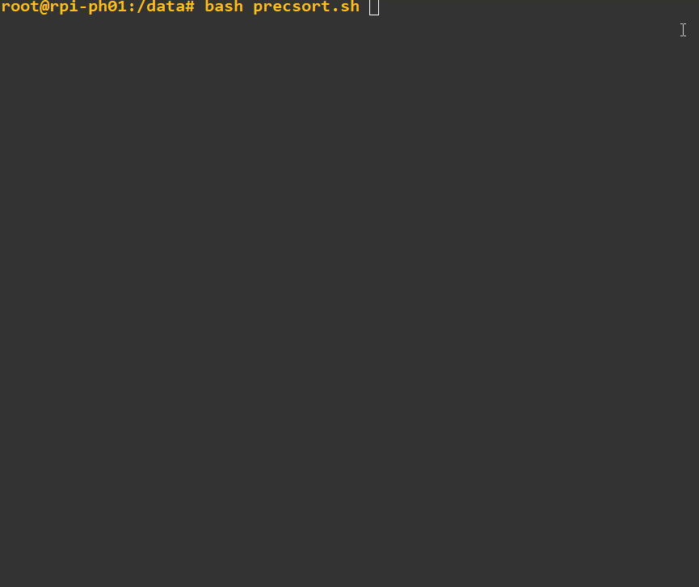

# PRECsort
The purpose of this script is to assist in going through data recovered via Photorec (https://www.cgsecurity.org/wiki/PhotoRec), this data will all be unsorted in recup_XX dirs which is not very easy to go through manually since there might be hundreds of directories with a large mix of different files in each without any particular structure.
  

The script will take two arguments, a source directory ($1) and a destination directory ($2), the source directory should be the destination directory that you used as a for Photorec and destination directory should be a new directory where you want to move the sorted data.


For each extension found, a subdirectory will be created in your destination directory and files with be placed in the directory matching its extension. Only files >0 bytes will be moved, we'll ignore empty files. Once all files are moved, fdupes is used to clear out any detected duplicates. If there were any JPG files recovered, exiftool is used to rename and sort some extensions based on their EXIF timestamp and then further sort by year (where possible).

Big shout-out to Phil Harvey for exiftool, Adrian Lopez for fdupes and of course Christophe Grenier for his amazing Photorec check out their projects:
 - [exiftool on github](https://github.com/exiftool/exiftool) 
 - [fdupes on github](https://github.com/adrianlopezroche/fdupes)
 - [photorec/testdisk on github](https://github.com/cgsecurity/testdisk)


*Requirements: exiftool and fdupes needs to be installed on system. (Depending on your distro: ```apt-get install exiftool fdupes```)


 - Syntax: ```bash precsort.sh {source} {destination}```
 - Example:```bash precsort.sh /mnt/recovered/ /data/sorted/```  

GIF of script in action:

